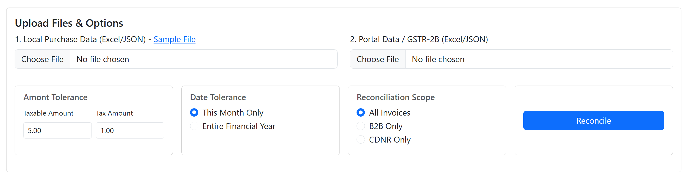

# 🧾 GST Reconciliation Tool 📊

## Description

Streamline your GST reconciliation process! ✅ This project provides a robust backend API designed to reconcile GST data between your local accounting/purchase records (Excel/JSON) and the official GSTR-2B data downloaded from the GST portal (JSON/Excel). It intelligently parses input files, normalizes key fields, performs matching using flexible rules and user-defined tolerances, categorizes the results comprehensively, and generates detailed reconciliation reports in Excel format.

This README covers the current state of the project (Phase 1: Backend API with Test Frontend).

_(Screenshot of the current Test UI)_


## Features (Current - Phase 1) ✨

* **Flexible Parsing:** Parses GST data from local Excel (`.xlsx`) files and official GSTR-2B JSON files (handling B2B and CDNR sections). 📝
* **Smart Normalization:** Normalizes key fields like Invoice Number (removing suffixes, standardizing case) and Date for accurate matching. ⚙️
* **Configurable Reconciliation Rules:**
    * Matches records based on Supplier GSTIN, Normalized Invoice Number, and Date.
    * **User-defined Tolerances:** Specify acceptable differences (+/-) for Taxable Amount and Total Tax. 💰
    * **User-defined Date Matching:** Choose between matching within the 'Same Month' or the 'Same Financial Year'. 🗓️
    * **User-defined Scope:** Reconcile 'All' data, only 'B2B Invoices', or only 'Credit/Debit Notes (CDNR)'. 🎯
* **Fuzzy Matching:** Identifies "Potential Matches" where Date and Amounts align, but Invoice Numbers have minor differences (using Levenshtein distance). 🤔
* **Comprehensive Categorization:** Classifies results into multiple categories for clarity:
    * Perfectly Matched Records ✅
    * Matched within Tolerance 👍
    * Mismatched Amounts (Date/Inv# match, Amounts differ) ⚠️
    * Potential Matches (Date/Amounts match, Inv# similar)❓
    * Missing in Portal (GSTR-2B) 👻
    * Missing in Local Books  LNK 👻
* **Structured JSON Output:** Provides detailed results via the API in a structured JSON format.
* **Detailed Excel Reports:** Generates a downloadable multi-sheet Excel report (`.xlsx`) categorizing results into separate sheets for easy review. 📄
* **Development Test Frontend:** Includes a basic static HTML/JS frontend (`public/`) for easy interaction and testing during development. 🧪

## Architecture Overview (Phase 1) 🏗️

* **Backend API:** Built with Node.js, TypeScript, and Express.
* **Style:** API-first, modular services, dependency injection (using `tsyringe`).
* **Core Logic:** Encapsulated in framework-agnostic services (`src/core`) including dedicated services for Parsing, Validation/Standardization, Reconciliation, and Reporting.
* **Infrastructure:** Express handles web server duties, routing, middleware (file uploads with `multer`, error handling). Winston for logging.
* **Data Handling:** Primarily in-memory processing per request. No persistent database for reconciliation data in this phase.
* **Error Handling:** Centralized middleware using custom error classes.
* **Configuration:** Managed via environment variables (e.g., `.env`, `.development.env`) loaded using Node.js's built-in `--env-file` flag (Node.js v20.6.0+ recommended). Default values are provided in the code.

## Folder Structure 📁
```
gst-reconciliation-tool/
├── public/                   # Minimal static frontend for Phase 1 testing
│   ├── index.html
│   ├── main.js
│   └── styles.css
├── src/                      # TypeScript source code
│   ├── config/               # App configuration
│   ├── core/                 # Core business logic
│   │   ├── common/           # Shared utilities, interfaces, errors
│   │   ├── parsing/          # File parsing logic
│   │   ├── validation/       # Data validation & standardization logic  <-- NEW
│   │   ├── reconciliation/   # Reconciliation logic & normalization
│   │   └── reporting/        # Report generation logic
│   ├── infrastructure/       # Frameworks, drivers, external integrations
│   │   ├── adapters/         # (Optional) Adapters for external libs
│   │   ├── jobs/             # (Optional) Async job handling
│   │   ├── logger/           # Logging setup (Winston)
│   │   └── webserver/        # Express setup, API routes, controllers, middleware
│   └── main.ts               # Application entry point
├── tests/                    # Automated tests (Setup needed)
│   ├── integration/
│   └── unit/
├── .env                      # Production environment variables (GIT IGNORED!)
├── .development.env          # Development environment variables (GIT IGNORED!)
├── .env.example              # Example environment variables
├── .gitignore
├── package.json
├── tsconfig.json
├── pnpm-lock.yaml            # Assuming pnpm is used
├── Plan.md                   # Detailed planning document (Optional)
└── README.md                 # This file
```

## Technology Stack 🛠️

* **Backend:** Node.js, TypeScript, Express
* **Dependency Injection:** `tsyringe`
* **File Parsing:** `xlsx` (SheetJS)
* **Report Generation:** `exceljs`
* **File Uploads:** `multer`
* **Date Handling:** Built-in Date, `date-fns` (Optional, for complex needs)
* **Logging:** `winston`
* **Utility:** `uuid`, `fastest-levenshtein`
* **Resilience (Optional):** `cockatiel`, `opossum` (Circuit Breaker/Retry)
* **Testing:** Jest, ts-jest (Recommended setup)
* **Linting/Formatting:** ESLint, Prettier
* **Package Manager:** pnpm (or npm/yarn)

*(Note: `dotenv` package is not strictly required if using Node.js v20.6.0+ with the `--env-file` flag.)*

## Setup and Installation ⚙️

1.  **Prerequisites:** Node.js (v20.6.0 or later recommended for `--env-file`), pnpm (or npm/yarn).
2.  **Clone the repository:**
    ```bash
    git clone <https://github.com/hakrNJN/gst-reconciliation-tool.git>
    cd gst-reconciliation-tool
    ```
3.  **Install dependencies:**
    ```bash
    pnpm install
    # or: npm install / yarn install
    ```
4.  **Set up environment variables:**
    * Copy `.env.example` to `.development.env` for development.
    * Copy `.env.example` to `.env` for production builds/runs.
    * Fill in the required variables (like `PORT`, tolerances if overriding defaults) in the relevant `.env` file(s).

## Running the Application 🚀

1.  **Development Mode (with auto-reload):**
    ```bash
    # Ensure .development.env file exists
    pnpm run dev
    ```
    *(This script uses `ts-node-dev` and loads `.development.env` as configured in `package.json`)*

2.  **Production Mode:**
    * First, build the TypeScript code:
        ```bash
        pnpm run build
        ```
    * Then, run the compiled JavaScript code:
        ```bash
        # Ensure .env file exists
        pnpm start
        ```
        *(This script uses `node` and loads `.env` as configured in `package.json`)*

The application will typically start on `http://localhost:3000` (or the port specified in your environment file). Access this URL in your browser to use the test frontend.

## API Endpoints 🚦

* **`POST /api/reconcile`**:
    * **Request:** `multipart/form-data` containing:
        * File: `localData` (Excel/JSON)
        * File: `portalData` (Excel/JSON)
        * Field: `toleranceAmount` (Number, optional - defaults to config)
        * Field: `toleranceTax` (Number, optional - defaults to config)
        * Field: `dateMatchStrategy` ('month' or 'fy', optional - defaults to 'month')
        * Field: `reconciliationScope` ('all', 'b2b', or 'cdnr', optional - defaults to 'all')
    * **Response (Success):** `200 OK` with JSON body containing `ReconciliationResults` (with `details` as a plain object `{gstin: {...}}`).
    * **Response (Error):** Appropriate error status code (e.g., 400, 500) with error details.
* **`POST /api/reconcile/export`**:
    * **Request:** `application/json` with the full `ReconciliationResults` JSON (as received from the `POST /api/reconcile` endpoint) in the request body.
    * **Response (Success):** `200 OK` with the Excel file stream (`application/vnd.openxmlformats-officedocument.spreadsheetml.sheet`) and `Content-Disposition` header for download.
    * **Response (Error):** Appropriate error status code (e.g., 400, 500).

## Input File Formats 📄

### 1. Local Purchase Data (Excel)

* **Format:** `.xlsx`
* **Structure:** First row = Headers. Subsequent rows = Invoice records. No merged cells in data area. Clean data preferred.
* **Columns:** See table below. Header names should ideally match examples (case-insensitive) for parser recognition.

| Header (Example)      | Description                           | Type             | Req?        | Internal Field        | Notes                                      |
| :-------------------- | :------------------------------------ | :--------------- | :---------- | :-------------------- | :----------------------------------------- |
| `Supplier GSTIN`      | 15-digit Supplier GSTIN               | Text             | ✅ Yes      | `supplierGstin`       | Crucial for grouping.                      |
| `Invoice Number`      | Supplier's Invoice ID                 | Text             | ✅ Yes      | `invoiceNumberRaw`    | Will be normalized.                        |
| `Invoice Date`        | Date of Invoice Issue                 | Date             | ✅ Yes      | `date`                | Use Excel Date format (e.g., DD-MM-YYYY). |
| `Taxable Amount`      | Value before GST                      | Number (Decimal) | ✅ Yes      | `taxableAmount`       | Used for tolerance matching.               |
| `IGST Amount`         | Integrated Tax Amount                 | Number (Decimal) | ✅ Yes      | `igst`                | Use 0 if not applicable (CGST/SGST used). |
| `CGST Amount`         | Central Tax Amount                    | Number (Decimal) | ✅ Yes      | `cgst`                | Use 0 if not applicable (IGST used).       |
| `SGST Amount`         | State/UT Tax Amount                   | Number (Decimal) | ✅ Yes      | `sgst`                | Use 0 if not applicable (IGST used).       |
| `Supplier Name`       | Name of Supplier                      | Text             | (Optional)  | `supplierName`        | Recommended for reporting.               |
| `Invoice Value`       | Total Invoice Amount                  | Number (Decimal) | (Optional)  | `invoiceValue`        | Recommended for cross-check.             |
| `Record ID / Sr No` | Your internal record ID/line #        | Text/Number      | (Optional)  | `originalLineNumber`  | Helps trace back to source.              |

### 2. Portal Data (GSTR-2B JSON / Excel)

* **JSON Format:** Expects the structure downloaded from the official GST portal. The parser currently processes `data.docdata.b2b` (B2B Invoices) and `data.docdata.cdnr` (Credit/Debit Notes - Registered). Support for amendments (B2BA, CDNA) can be added if needed.
* **Excel Format:** If providing portal data as Excel, ensure it has columns mappable (via `EXCEL_HEADER_MAP` in `file-parser.service.ts`) to the required fields (`supplierGstin`, `invoiceNumberRaw`, `date`, `taxableAmount`, `igst`, `cgst`, `sgst`).

## Testing 🧪 
# (Not included yet)

* **Run tests (Requires Jest setup):**
    ```bash
    pnpm test
    # or: npm test / yarn test
    ```
    *(Note: Configure Jest properly in `package.json` and `jest.config.js`. The default `test` script might need correction.)*
* Add unit tests for core services (parsing, validation, reconciliation, reporting) and normalization utils.
* Add integration tests for API endpoints.

## Phase 2 Plan (Brief) 💡

Phase 2 involves building a dedicated frontend Single Page Application (SPA) using React and TypeScript to consume the Phase 1 API, providing a more polished and interactive user experience. The minimal HTML/JS frontend from Phase 1 will be discarded.
